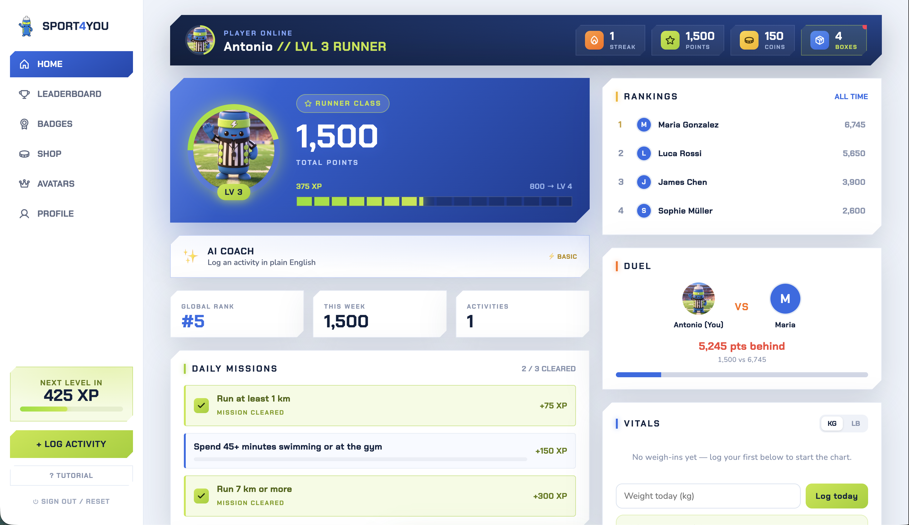
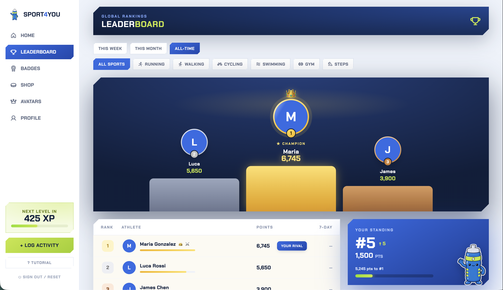
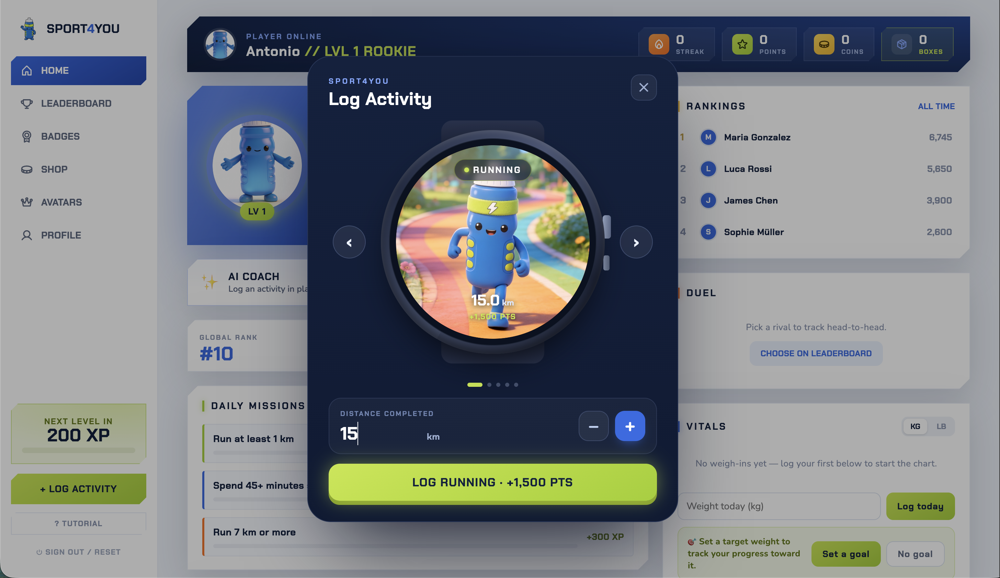
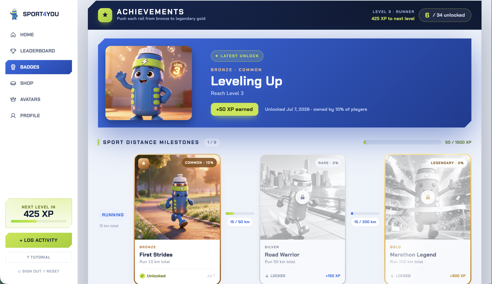
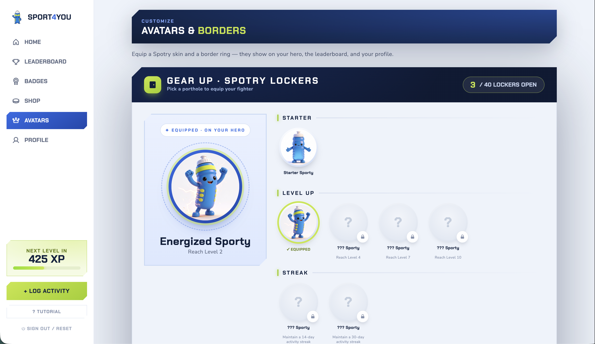
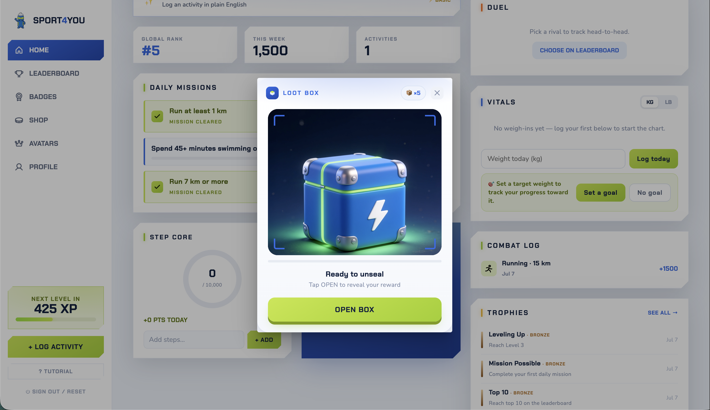
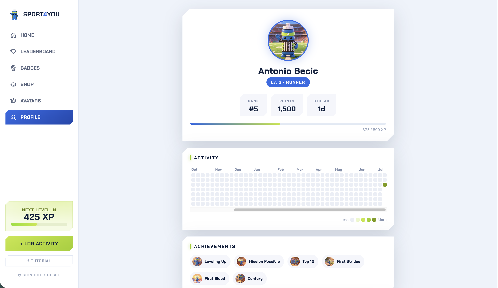
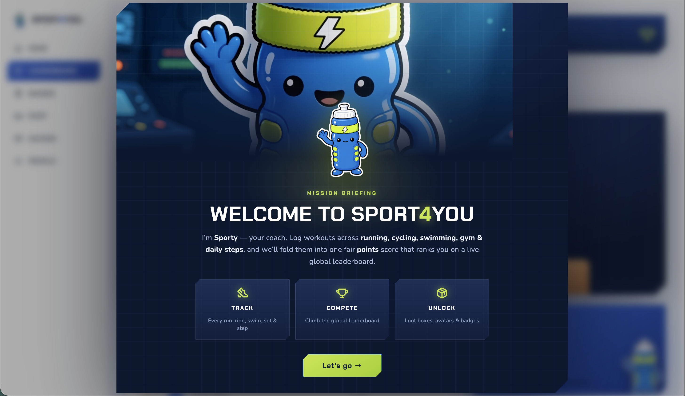

# Sport4You — Fitness Challenge Application

[](https://github.com/AntonioB27/Sport4You/actions/workflows/ci.yml)

A full-stack fitness gamification app: users register, log physical activities
across 6 sports, earn normalized points, and compete on a global leaderboard —
wrapped in a full game layer (XP/levels, daily quests, achievements, collectible
avatars, loot boxes, a coin shop, cosmetic borders, rivals, and more).

The assignment's required API contracts (`POST /api/users`, `POST /api/activities`)
are kept exact and unauthenticated on `main` by design — see
[Design Decisions](#design-decisions) for why, and
[Bonus: Full Auth Variant](#bonus-full-auth-variant) for a branch that changes them.

## Table of Contents

- [Screenshots](#screenshots)
- [Tech Stack](#tech-stack)
- [Prerequisites](#prerequisites)
- [Run with Docker](#run-with-docker)
- [Running Locally](#running-locally)
- [Project Structure](#project-structure)
- [Design Decisions](#design-decisions)
- [Features](#features)
- [API Reference](#api-reference)
- [Scoring System](#scoring-system)
- [Bonus: Full Auth Variant](#bonus-full-auth-variant)

## Screenshots

| Dashboard | Leaderboard |
|---|---|
|  |  |

| Log an activity | Achievements |
|---|---|
|  |  |

| Avatars & Borders | Loot Box |
|---|---|
|  |  |

| Public Profile | Welcome / Onboarding |
|---|---|
|  |  |

## Tech Stack

- **Backend:** C# / ASP.NET Core 8 Web API · Entity Framework Core · SQLite · Serilog
- **Frontend:** Angular 17 (standalone components, Signals) · Angular Material · Chart.js (ng2-charts)
- **Tests:** xUnit, 206 tests — `dotnet test` (mostly real SQLite-backed integration tests
  via `WebApplicationFactory`, plus a handful of Moq-based isolated unit tests); Karma/Jasmine
  on the frontend, both run in CI
- **API docs:** OpenAPI / Swagger UI at `/swagger`

## Prerequisites

- [.NET 8 SDK](https://dotnet.microsoft.com/download)
- [Node.js 20+](https://nodejs.org/) and npm

## Run with Docker

The fastest way to see the whole thing running — no .NET or Node install needed,
just [Docker](https://docs.docker.com/get-docker/) with Compose:

```bash
docker compose up --build
```

Then open **http://localhost:8080**.

Two containers come up: the ASP.NET Core API and an nginx image serving the
built Angular app. nginx reverse-proxies `/api` to the backend, so the app is
**single-origin** (no CORS in play) and the frontend talks to a relative `/api`
path — the same URL whether it's running in Docker or behind the dev proxy. The
API is also published on `http://localhost:5262` for direct poking, with
interactive Swagger UI at **http://localhost:5262/swagger**.

The SQLite database is seeded on first boot and persists on a named volume
(`fitness-data`), so restarts keep your data:

```bash
docker compose down      # stop, keep the database
docker compose down -v   # stop and wipe the database (fresh reseed next up)
```

> **AI Coach:** the natural-language activity parser falls back to a built-in
> regex parser unless a Claude API key is provided. To enable the LLM-backed
> parser, uncomment the `Anthropic__ApiKey` line in `docker-compose.yml` and set
> `ANTHROPIC_API_KEY` in your environment.

## Running Locally

Prefer running the two processes directly (for hot-reload during development)?

### 1. Start the backend

```bash
cd backend
dotnet run --project Sport4You.Api
```

The API will be available at `http://localhost:5262` (see `launchSettings.json`).
The database (`sport4you.db`, SQLite) is created and seeded automatically on
first run — five demo users with realistic activity history are pre-loaded so
the leaderboard, dashboard, and achievements aren't empty on first look.

### 2. Start the frontend

In a new terminal:

```bash
cd frontend
npm install
npm start
```

`npm start` runs `ng serve` with `proxy.conf.json`, which forwards `/api` to the
backend on `:5262` — so the frontend uses the same relative `/api` path it does
in Docker. (Running `ng serve` bare would skip the proxy; use `npm start`.)

Open `http://localhost:4200` in your browser and register a new account (or
use `POST /api/users/login` with one of the seeded names — see `DataSeeder.cs`
— to explore an account with existing history/progress).

### Running backend tests

```bash
cd backend
dotnet test
```

206 tests, all passing. Coverage spans the assignment-required logic
(`ScoringServiceTests.cs` — pure unit tests of every sport's points formula,
including floor/edge-case behavior) and every game-layer subsystem, mostly as
real integration tests against an in-memory SQLite database through the
actual HTTP pipeline (`WebApplicationFactory`) rather than mocked layers —
plus a small set of Moq-based isolated unit tests
(`ActivityServiceMockedTests.cs`) that mock every collaborator to verify
orchestration logic in isolation, complementing the integration-test style
used everywhere else.

Frontend tests (`cd frontend && npx ng test --no-watch --browsers=ChromeHeadless`) run via
Karma/Jasmine and are part of CI alongside the backend suite.

> **Note:** the SQLite schema is created via EF Core's `EnsureCreated()`
> (no migrations). If you pull an update that changes a model and the app
> throws a missing-column error, delete `backend/Sport4You.Api/sport4you.db`
> and restart — it reseeds automatically.

## Project Structure

```
sport4you/
├── backend/
│   ├── Sport4You.Api/      # Controllers → Services → Repositories → EF Core
│   └── Sport4You.Tests/    # xUnit, real DB-backed integration tests
└── frontend/
    └── src/app/            # Angular standalone components, one feature per folder
```

## Design Decisions

A few choices worth calling out — not because they're unusual, but because
they're the kind of trade-off a take-home should make explicit rather than
leave implicit:

- **Layered architecture:** Controllers → Services → Repositories → EF Core.
  Services hold business logic and are the unit-testable layer; controllers
  stay thin (parse request → call service → map result to HTTP status).
- **Points are stored at write time, not recalculated on read.** A leaderboard
  query is a single indexed sum over pre-computed values, not N recalculations
  per request — this is the difference between an O(1)-per-row read and an
  O(activities) one at leaderboard scale.
- **`ScoringService` is pure and stateless** (no DB dependency) specifically so
  the assignment's scoring formulas can be unit-tested in isolation from any
  database or HTTP concern — see `ScoringServiceTests.cs`.
- **No authentication on `main`, by design, not by omission.** The assignment
  spec's registration contract (`firstName`/`lastName`, no password) implies an
  unauthenticated model; a `userId` GUID acts as a bearer token in
  `localStorage`, and re-entering a (unique) name recovers the account. Adding
  real auth would have meant deviating from the given contract — instead,
  that variant lives on a separate branch (`feature/auth`) that's free to
  change the contract, keeping `main` spec-compliant. This is a deliberate
  scope boundary, not a security oversight.
- **Rewards are evaluated in one pipeline on write.** Logging an activity
  evaluates XP, daily missions, achievements, avatar unlocks, and loot-box
  grants in a single request, and the response carries everything newly
  unlocked so the frontend can queue up its celebration animations without a
  second round trip.
- **Rank trend** is computed by comparing current total points against points
  from activities older than 7 days — a cheap window comparison rather than a
  stored history table, since the leaderboard only needs "trending up/down,"
  not an exact historical curve.
- **Daily steps accumulate through their own endpoint** (`POST
  /users/{id}/steps`), not `/api/activities` — sending `sport: "daily_steps"`
  to the activities endpoint is rejected. Steps are a running daily total
  (multiple check-ins per day should add up), which is a different write
  pattern than "one activity, one row," so it gets its own endpoint rather
  than overloading the assignment's activity contract with upsert semantics.
- **Weight tracking is intentionally isolated from everything competitive.**
  It never touches XP, achievements, or the leaderboard — a private health
  metric shouldn't be gamified or visible to other users, so it's modeled as
  two fully separate tables with their own service, not bolted onto `User`.
- **Backend tests mix two styles on purpose.** Most tests are real-DB
  integration tests through the actual HTTP pipeline, which is the right
  default for a small app where most bugs live at the seams between layers.
  `ActivityService` also has a set of Moq-based unit tests that mock every
  collaborator — a deliberate example of isolating a unit under test, kept
  additive rather than replacing any integration coverage.
- **AI Coach never writes on parse.** `POST /api/activities/parse` only
  drafts a suggestion (sport, metric, points preview); confirming it calls
  the same `POST /api/activities` / steps endpoints as manual logging, so the
  assignment's write contracts have exactly one path into the database
  regardless of how an activity was described.

## Features

**Core (per the assignment)**
- Register with first + last name (unique), log activities across 6 sports
  with sport-specific normalized scoring
- Global leaderboard, ranked by total points, with rank trends, filterable by
  time period (this week / this month / all-time) and by sport
- Personal dashboard: activity history, points-over-time and sport-breakdown
  charts

**Progression**
- **XP & levels** — every activity grants XP; 10 level titles from Rookie to
  Immortal, with level-up celebration animations
- **Prestige** — at max level, reset to Level 1 for a permanent small XP
  bonus and a prestige star badge shown next to your avatar everywhere it
  appears (leaderboard, dashboard, profile)
- **Daily quests** — three rotating missions per day (easy/medium/hard) with
  a completion sweep bonus for finishing all three
- **Achievements** — 34 badges (33 base + a "Platinum Completionist" meta-
  achievement for earning all the others) across distance, duration, steps,
  streak, level, leaderboard-rank, and one-time feats; browsable on a
  "Trophy Track" page with bronze→silver→gold→platinum progression rails,
  live progress bars, and population-wide rarity stats ("owned by N% of
  players")
- **Personal records** — per-sport bests, biggest single day, and longest
  streak ever achieved, surfaced on your own profile

**Collection & economy**
- **Collectible avatars** — 40 total: 21 unlock-path skins (level/streak/
  badge/activity-count gated), 13 loot-box exclusives, and 6 shop-exclusive
  avatars purchasable directly with coins; equipped from a "Locker Select"
  picker and shown on the dashboard hero, leaderboard, and profile
- **Loot boxes** — earned free on level-ups and completed missions, or bought
  in two tiers (Normal / Special, the latter with better odds) from the Shop;
  opened through a video-driven "Signal Vault" ceremony with rarity-teased
  reveals; duplicate pulls convert to bonus XP instead of being wasted
- **Coins & Shop** — a soft currency earned from every logged activity
  (proportional to points earned), spendable on an XP booster, loot boxes,
  and the 6 shop-exclusive avatars — a second progression track alongside XP
  that never overlaps with it
- **Profile borders** — cosmetic rings won from loot boxes or earned via the
  Platinum meta-achievement, rendered around your avatar everywhere it
  appears
- **Rivals** — pick another player to track head-to-head on the dashboard
  (points gap, who's ahead), independent of your overall leaderboard rank

**Tracking**
- **AI Coach** — log an activity by typing it in plain English (e.g. "ran 5k
  in 25 min"); a Claude-backed parser (with an offline regex fallback when no
  API key is configured) extracts the sport and metric, previews the points,
  and asks for clarification if something's ambiguous, before confirming
  through the same endpoints as manual logging
- **Daily steps** — dedicated accumulating endpoint (checking in multiple
  times a day adds up) with a dashboard widget
- **Weight tracking** — private, non-competitive daily weigh-ins with a
  progress chart and optional goal line; kg/lb toggle; entirely isolated
  from the game/points layer
- **Contribution heatmap** — GitHub-style activity calendar on the profile
- **Unlock ceremonies** — full-bleed animated splash screens for activity
  confirmation (sport-specific video backgrounds), achievement unlocks, and
  avatar unlocks
- **Account recovery** — since names are unique, re-entering your name via
  `POST /api/users/login` restores your account after clearing browser
  storage
- **Guided onboarding** — every page is gated behind a blurred login/register
  wall until an identity exists; first-time registration follows with a
  full-bleed welcome splash and a guided spotlight tour of the app (replayable
  any time from the sidebar's "Tutorial" button)
- **Public profiles** — view any user's level, stats, badges, avatars, and
  personal records from the leaderboard

## API Reference

| Method | Endpoint | Description |
|--------|----------|--------------|
| GET | `/api/health` | Liveness/readiness probe (checks DB connectivity) |
| POST | `/api/users` | Register a new user *(assignment contract)* |
| POST | `/api/users/login` | Recover an account by name |
| POST | `/api/activities` | Log a fitness activity *(assignment contract)* |
| POST | `/api/activities/parse` | AI Coach — parse free-text into a draft activity (never writes) |
| GET | `/api/ai/status` | `"ai"` if a Claude API key is configured, else `"basic"` (regex fallback) |
| POST | `/api/users/{id}/steps` | Add to today's accumulating step total |
| POST | `/api/users/{id}/prestige` | Prestige at max level |
| GET | `/api/users/{id}/weight` | Weight history + goal |
| POST | `/api/users/{id}/weight` | Log today's weight (upserts) |
| PUT | `/api/users/{id}/weight/goal` | Set/update goal weight |
| GET | `/api/leaderboard?period=&sport=` | Ranked leaderboard (avatars, borders, trends); `period` is `7d`\|`30d`\|`all`, `sport` is `all` or one of the six sports |
| GET | `/api/users/{id}/dashboard` | Everything the dashboard needs, in one call |
| GET | `/api/users/{id}/achievements` | Achievement statuses, progress, XP summary |
| GET | `/api/users/{id}/personal-records` | Per-sport bests, biggest day, longest streak |
| GET | `/api/users/{id}/avatars` | Avatar collection with unlock/ownership state |
| PUT | `/api/users/{id}/avatar` | Equip an avatar |
| GET | `/api/users/{id}/borders` | Border collection |
| PUT | `/api/users/{id}/border` | Equip a border |
| GET | `/api/users/{id}/boxes` | Pending loot box count |
| POST | `/api/users/{id}/boxes/open` | Open the oldest pending loot box |
| GET | `/api/users/{id}/shop` | Shop catalog (booster, loot boxes, avatars) + coin balance |
| POST | `/api/users/{id}/shop/booster` | Buy the XP booster |
| POST | `/api/users/{id}/shop/lootbox` | Buy a loot box (`{ tier: "normal" \| "special" }`) |
| POST | `/api/users/{id}/shop/avatar` | Buy a shop-exclusive avatar |
| GET | `/api/users/{id}/rival` | Current rival |
| PUT | `/api/users/{id}/rival` | Set a rival |
| DELETE | `/api/users/{id}/rival` | Clear rival |

## Scoring System

| Sport | Metric | Formula |
|-------|--------|---------|
| Running | km | floor(km × 100) |
| Walking | km | floor(km × 50) |
| Cycling | km | floor(km × 25) |
| Swimming | mm:ss | floor(minutes × 15) |
| Gym | mm:ss | floor(minutes × 5) |
| Daily Steps | count | floor(steps ÷ 100) |

## Bonus: Full Auth Variant

`main` intentionally keeps the assignment's anonymous API contracts
(name-only registration, unauthenticated ingestion). A full
username/password/JWT variant — register/login pages, bearer-protected
write endpoints, logout — lives on branch
[`feature/auth`](../../tree/feature/auth). It changes the registration
contract, which is why it is kept out of `main` by design. When running
that branch for the first time, delete `backend/Sport4You.Api/sport4you.db`
so the new schema seeds (demo accounts: `maria` / `demo1234`).
